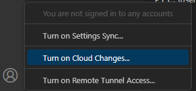
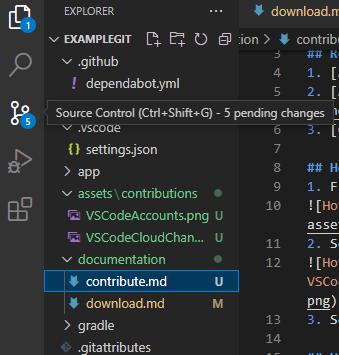
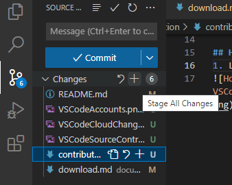
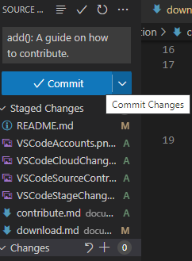

# How to contribute to this repo

## Requirements
1. [A GitHub Account](https://github.com/signup)
2. [A repository](download.md#how-to-download-a-github-repository)
3. [Git](download.md#how-to-download-git)

## How to sign into VSCode with a GitHub account.
1. Find the account section.

2. Select "Turn on cloud changes".

3. Select "Sign in with GitHub"

## How to commit changes
1. Locate the source control section in VSCode.

2. Click the + icon to stage changes, when you stage changes you mark them as ready to be comitted.

3. Fill in a commit message, you may be tempted to have generic names however it will be easier to search the repository's GitHub. I typically begin my commit messages with "add():, fix():, docs():, update():, etc..." 
