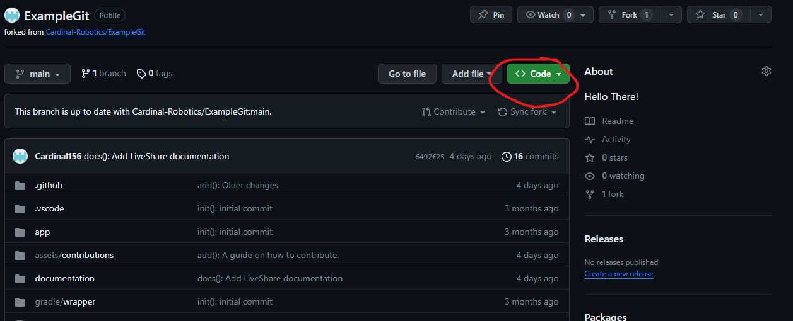
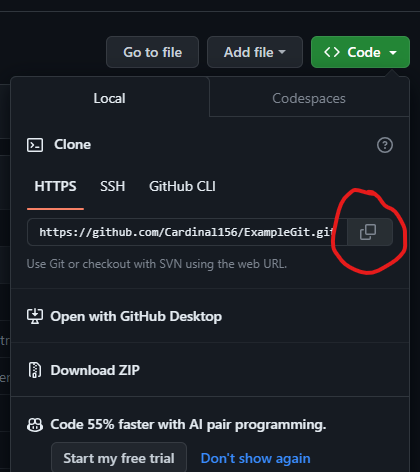

# How to download this repository

## Requirements:
1. VSCode (Use the one installed through WIPLib)
2. [A fork](fork-and-branches.md#how-to-make-forks-and-branches)
3. [Git](#how-to-download-git)

## How to download Git

1. Visit the [Git website](https://git-scm.com/download/win) and press `Click here to download`.
2. Open the executable and press "Next" twice.
3. On the default editor page select `Select other editor as Git's default editor`, set the location to `C:\Users\Public\wpilib\2023\vscode\Code.exe` and then press next.
4. Override the default branch name to "main", press "Next" ten more times.
5. After installing Git, restart the computer.

## How to download a GitHub repository.

1. Open file explorer.

2. Go into Documents and make sure there is a folder called `JavaData`.

3. Open VSCode, then open the terminal (ctrl + \`).

4. Enter `cd C:\Users\cardinalbots\Documents\JavaData` into the terminal.

5. Go to your fork and press on the "Code" dropdown.

6. Press the copy button that looks like two squares.

7. After that go back to VSCode's terminal and enter `git clone https://github.com/YOUR_COPIED_URL_GOES_HERE`

8. Right click on VSCode in the taskbar, and press "New Window". 

9. Using this new instance of VSCode, press "Open Folder", navigate to the JavaData folder and open the ExampleGit folder as a project.