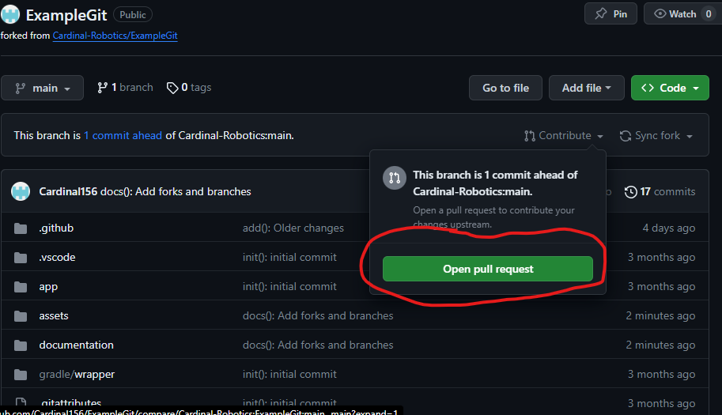

# How to make a pull request.

## Requirements:
1. A GitHub account.
2. A fork/branch.
3. Changes to the code.

## How to make pull requests.
1. Commit (save) and push (upload) your changes to your fork/branch.
2. Go to your fork/branch on GitHub.
3. Open the Contribute dropdown.

4. Create a description of your pull request, the one in the images have an idea of what it could look like however it isn't necessary. Make sure to mark your PR as a draft if it is an unfished PR or

5. Create the pull request, and wait for it to be accepted, good luck.
